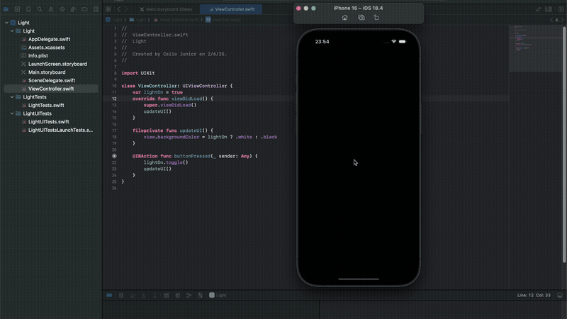

# Light — Your Screen as a Flashlight

**Light** is a simple iOS app built with Swift that turns your iPhone screen into a flashlight by switching the background color between **black** and **white** with the tap of a button.

## Built With

- Swift  
- UIKit

## Demonstration 

